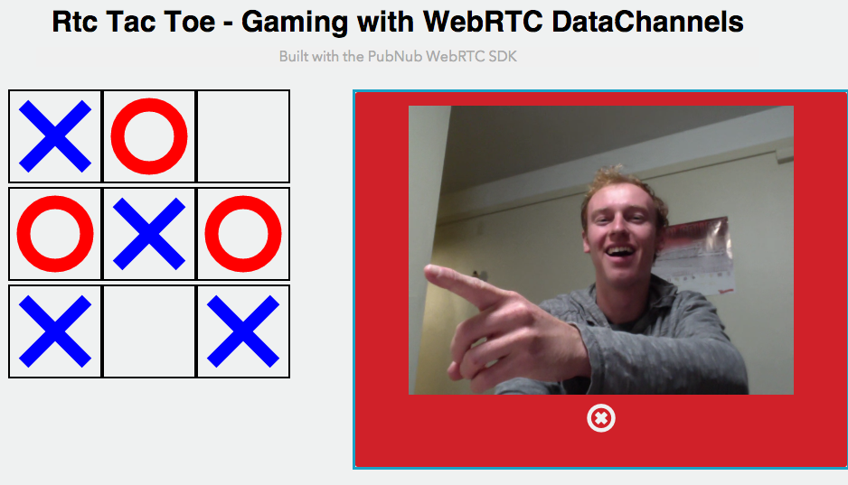
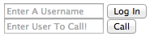
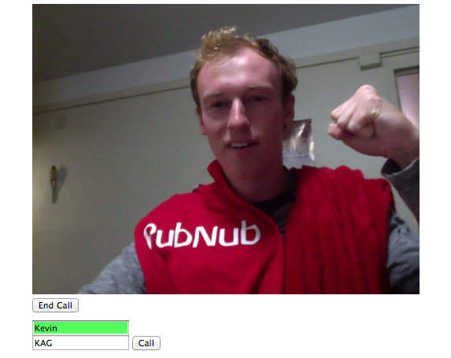
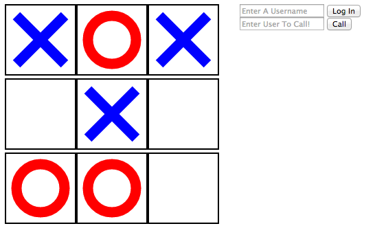

## WebRTC Gaming - TicTacToe



[View the WebRTC TicTacToe Tutorial on
Scotch.io](https://scotch.io/tutorials/learn-webrtc-build-a-real-time-tic-tac-toe)

Time to show off the versatility of WebRTC. If you don't know it already, WebRTC is a free, open-source project that provides simple APIs for creating Real-Time Communications (RTC) for browsers and mobile devices. It makes streaming any content such as video, audio, or arbitrary data simple and _fast_!

## PubNub for Signaling.

WebRTC is not a standalone API, it needs a signaling service to coordinate communication. Metadata needs to be sent between callers before a connection can be established. 

This metadata includes things such as:

- Session control messages to open and close connections
- Error messages
- Codecs/Codec settings, bandwidth and media types
- Keys to establish a secure connection
- Network data such as host IP and port

Once signaling has taken place, video/audio/data is streamed directly between clients, using WebRTC's `PeerConnection` API. This peer-to-peer direct connection allows you to stream high-bandwidth robust data, like video. In addition, we will be using `DataChannels` to stream messages through our RTC connection.

PubNub makes this signaling incredibly simple, and then gives you the power to do so much more with your WebRTC applications.

### Browser Compatibility

WebRTC is widely adopted by popular browsers such as Chrome and Firefox, but there are many browsers on which certain features will not work. See a list of [supported browsers here](http://iswebrtcreadyyet.com/).

## Part 1: The Video Setup
Time to begin! First I will show you how to make the bare minimum WebRTC video chat. Then, in Part 2 we will be using the WebRTC `DataChannel` API to play TicTacToe. The live demo for this tutorial [can be found here](http://kevingleason.me/WebRTC-TicTacToe/rtctactoe.html)!

### A Note on Testing and Debugging

If you try to open `file://<your-webrtc-project>` in your browser, you will likely run into Cross-Origin Resource Sharing (CORS) errors since the browser will block your requests to use video and microphone features. To test your code you have a few options. You can upload your files to a web server, like [Github Pages](https://pages.github.com/) if you prefer. However, to keep development local, I recommend you setup a simple server using Python.

To so this, open your terminal and change directories into your current project and depending on your version of Python, run one of the following modules.

    cd <project-dir>

    # Python 2
    python -m SimpleHTTPServer <portNo>
    
    # Python 3
    python -m http.server <portNo>
    
For example, I run Python2.7 and the command I use is `python -m SimpleHTTPServer 8001`. Now I can go to `http://localhost:8001/index.html` to debug my app! Try making an `index.html` with anything in it and serve it on localhost before you continue.

### Step 1: The HTML5 Backbone

```html
<div id="tic-tac-box" style="float: left; width: 47%;"></div>
<div style="float: left; width: 50%;">
    <div id="video-chat" hidden="true">
		<div id="vid-box"></div>
		<button onclick="end()">End Call</button>
    </div>
    <form name="loginForm" id="login" action="#" onsubmit="return login(this);">
        	<input type="text" name="username" id="username" placeholder="Enter A Username"/>            
			<input type="submit" name="login_submit" value="Log In">
    </form>
	<form name="callForm" id="call" action="#" onsubmit="return makeCall(this);">
        <input type="text" name="number" id="call" placeholder="Enter User To Call!"/>
        <input type="submit" value="Call">
	</form>
</div>
````

This should leave you with a very basic HTML backbone that looks something like this:



The `tic-tac-box` div will house our game board, and `video-chat` is where we will place our WebRTC video stream. I use `style="float: left; width: 50%"` to align our video chat and game side by side.

### Step 2: The JavaScript Imports

There are three libraries that you will need to include to make WebRTC operations much easier. The first thing you should include is [jQuery](https://jquery.com/) to make modifying DOM elements a breeze. Then, you will need the PubNub JavaScript SDK to facilitate the WebRTC signaling. Finally, include the PubNub WebRTC SDK which makes placing phone calls as simple as calling the `dial(number)` function.

```html
<script src="https://ajax.googleapis.com/ajax/libs/jquery/2.1.3/jquery.min.js"></script>
<script src="https://cdn.pubnub.com/pubnub.min.js"></script>
<script src="http://kevingleason.me/WebRTC-TicTacToe/js/webrtc-2.0.0.js"></script>
<script src="http://kevingleason.me/WebRTC-TicTacToe/js/tictactoe.js"></script>
```

The `tictactoe.js` is a basic game implementation I found online and modified to make this tutorial easy. It has functions to mark squares and reset the game. 

Now we are ready to write our calling functions for `login`, `makeCall`, and `end`!

### Part 3: Making and Receiving Calls

In order to start facilitating video calls, you will need a publish and subscribe key. To get your pub/sub keys, you’ll first need to [sign up for a PubNub account](http://www.pubnub.com/get-started/). Once you sign up, you can find your unique PubNub keys in the [PubNub Developer Dashboard](https://admin.pubnub.com). The free Sandbox tier should give you all the bandwidth you need to build and test your WebRTC Application.

```javascript
var video_hold = document.getElementById("video-chat");
var video_out  = document.getElementById("vid-box");

function login(form) {
	user_name = form.username.value || "Anonymous";
	var phone = window.phone = PHONE({
	    number        : user_name, // listen on username line else Anonymous
	    publish_key   : 'your_pub_key',
	    subscribe_key : 'your_sub_key',
	    datachannels  : true,  // Enable Data Channels
	});	
	phone.ready(function(){ form.username.style.background="#55ff5b"; form.login_submit.hidden="true"; });
	phone.receive(function(session){
	    session.connected(function(session) { video_hold.hidden=false; video_out.appendChild(session.video); });
	    session.ended(function(session) { video_out.innerHTML=''; });
	});
	... // Prepare Data Channel
	return false;
}
```

You can see we use the username as the phone's number, and instantiate PubNub using your own publish and subscribe keys. The next function `phone.ready` allows you to define a callback for when the phone is ready to place a call. I simply change the username input's background to green, but you can tailor this to your needs.

The `phone.receive` function allows you to define a callback that takes a session for when a session (call) event occurs, whether that be a new call, a call hangup, or for losing service, you attach those event handlers to the sessions in `phone.receive`. 

I defined `session.connected` which is called after receiving a call when you are ready to begin talking. I simply appended the session's video element to our video div. 

Then, I define `session.ended` which is called after invoking `phone.hangup`. This is where you place end-call logic. I simply clear the video holder's innerHTML.

We now have a phone ready to receive a call, so it is time to create a `makeCall` function.

```javascript
function makeCall(form){
    if (!window.phone) alert("Login First!");
    else phone.dial(form.number.value);
    return false;
}
```

If `window.phone` is undefined, we cannot place a call. This will happen if the user did not log in first. If it is, we use the `phone.dial` function which takes a number and an optional list of servers to place a call.

Finally, to end a call or hangup, simply call the `phone.hangup` function and hide the video div.

```javascript
function end(){
	if (!window.phone) return;
	window.phone.hangup();
	video_hold.hidden = true;
}
```



You should now have a working video chatting application! When you are ready we can move on and implement the game functions.


## Part 2: Implementing Your Game

As I said earlier, the TicTacToe script has a few helpful functions. We will be using `onSquareClicked`, and `markBox`. 

### Step 1: Setup the Game Board

To get started, lets set a few global variables:

```javascript
var game_board = document.getElementById("tic-tac-box");
var user_name = "";
```

The `game_board` will be populated with the TicTacToe board, and `user_name` will store the currently logged in user. We can fill our `game_board` with our game with the following code:

```javascript
var game_board = ticTacToe(game_board);
```

If all goes well you should see your basic HTML backbone alongside a clickable TicTacToe board!



### Step 2: Using The DataChannel API

The `game_board.onSquareClicked` function allows us to define a callback that will be used whenever a user makes a valid move.

```javascript
game_board.onSquareClicked(
	function(squareNum){  // Number of the box that was clicked
		if (!window.phone) return;
		var data = {square:squareNum, username:user_name};
		window.phone.sendData(data);
	}
)
```

If you have followed any of my other WebRTC tutorials, you will notice that we use `phone.sendData` instead of `phone.send` here. `sendData` will send 1:1 messages through the WebRTC DataChannel API for immediate interactions, while `send` uses the 1:many PubNub streaming network. The PubNub WebRTC SDK allows us to seamlessly transition between both. 

__The PubNub streaming network is ideal for things like global map chat, while DataChannels are quicker for player interactions such as dodging.__

### Step 3: Receiving Messages

We have now sent messages through the DataChannel API, but we still need to implement the receiving code. The PubNub WebRTC SDK allows you to define a DataChannel callback `phone.datachannel(callbackFxn)` to handle incoming messages. The callback function should take one parameter, `msg`, which is the incoming data message.

```javascript
function onDataReceived(msg){
	var sqr_num = msg.square;
	game_board.markBox(sqr_num);
}
```

Simply put, we receive the data send in `onSquareClicked`, of the form `{square : squareNum}`, and then mark the `game_board`. The final step is to register this callback with our `phone` object. In the `login` function, right before we return, add a call to `phone.datachannel`.

```javascript
function login(form) {
	// Setup phone
	// Ready and Receive Callbacks
	...
	phone.datachannel(onDataReceived);
	return false;
}
```

Our callback has now been registered. Thats it, this will mark the box that the other player selected, allowing us to play together!


### Want to learn more?

Me too. Here are some other resources PubNub offers on WebRTC:

- [PubNub Android WebRTC API](https://github.com/GleasonK/android-webrtc-api)
- [Android WebRTC Example](https://github.com/GleasonK/AndroidRTC/)
- [PubNub WebRTC SDK](https://github.com/stephenlb/webrtc-sdk)
- [What is WebRTC](http://www.pubnub.com/blog/what-is-webrtc/)

We will be putting out more information and tricks of using WebRTC in the coming weeks so stay tuned!
